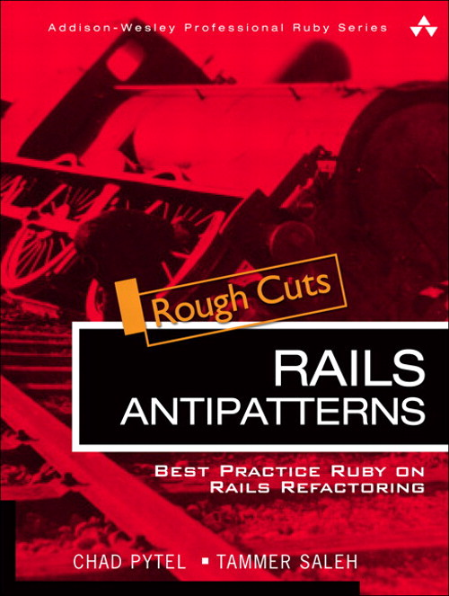

!SLIDE first

# Plato's Forms

## Some examples of Rails best practices.

### Tammer Saleh : tammersaleh.com

!SLIDE

## The importance of code you can believe in.

!SLIDE

!SLIDE

# Read the book

!SLIDE

# Questions?

